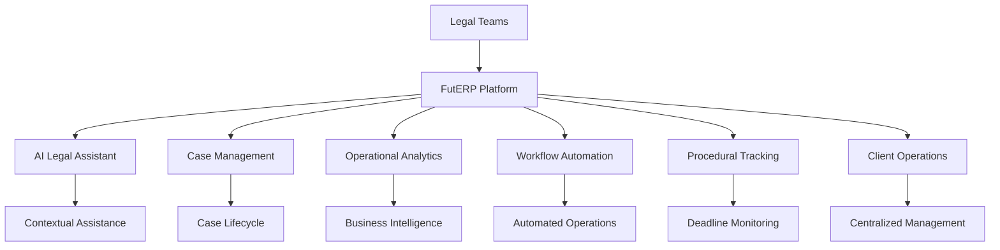
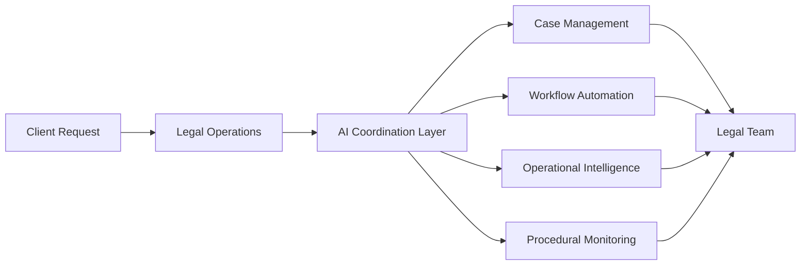
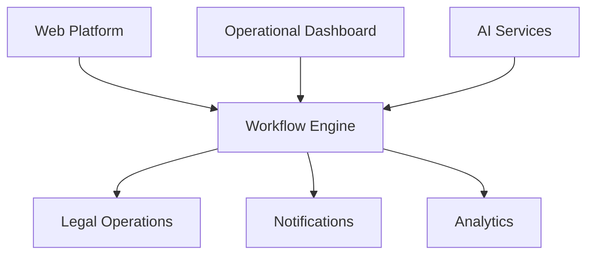

# FutERP Abogados

> AI-Native Legal Operations Platform

FutERP Abogados is a modern legal operations platform designed to help law firms centralize workflows, automate repetitive processes, improve operational visibility, and augment legal teams through artificial intelligence.

The platform combines intelligent automation, operational analytics, contextual AI assistance, and legal workflow orchestration into a unified ecosystem built for modern legal practices.

---

## Vision

Legal operations remain highly fragmented across disconnected tools, manual processes, spreadsheets, and reactive workflows.

FutERP was created to modernize legal operations through an AI-native infrastructure capable of supporting legal professionals with:

* intelligent workflow coordination
* operational automation
* centralized case management
* contextual assistance
* real-time operational visibility
* scalable legal infrastructure

The goal is not to replace legal professionals.

The goal is to reduce operational friction and improve strategic execution.

---

# Platform Overview

---

# Core Capabilities

## AI-Powered Legal Assistance

FutERP includes an intelligent legal assistant designed to support operational and administrative workflows through contextual AI interactions.

Capabilities include:

* contextual legal assistance
* operational coordination
* workflow support
* automated legal drafting
* intelligent notifications
* activity tracking
* procedural guidance

---

## Centralized Case Operations

The platform centralizes legal case operations into a unified environment where firms can manage:

* legal cases
* deadlines
* milestones
* operational status
* internal workflows
* client relationships
* procedural events

---

## Operational Intelligence

FutERP provides operational visibility through analytics and business dashboards focused on:

* workflow efficiency
* operational activity
* firm performance
* procedural monitoring
* productivity metrics
* organizational insights

---

## Workflow Automation

The platform automates repetitive operational processes including:

* procedural reminders
* operational notifications
* legal workflow coordination
* task tracking
* activity logging
* internal operational events

---

# Operational Flow

---

# Key Benefits

| Area                      | Impact                             |
| ------------------------- | ---------------------------------- |
| Administrative Operations | Reduced operational overhead       |
| Workflow Coordination     | Centralized operational visibility |
| Legal Operations          | Improved procedural organization   |
| Team Productivity         | Reduced repetitive tasks           |
| Operational Scalability   | Infrastructure prepared for growth |
| Decision Support          | Data-driven operational insights   |

---

# Platform Principles

FutERP is designed around four operational principles:

### Centralization

Unify legal operations into a single operational ecosystem.

### Automation

Reduce repetitive administrative workloads through intelligent workflows.

### Intelligence

Provide operational visibility and contextual assistance through AI systems.

### Scalability

Enable legal firms to scale operations without increasing operational complexity.

---

# High-Level Architecture

---

# Designed For

FutERP is designed for:

* law firms
* legal operations teams
* litigation departments
* legal consultants
* growing legal practices
* modern legal organizations seeking operational efficiency

---

# Current Focus Areas

The platform is actively evolving across several operational areas:

* AI-assisted legal workflows
* operational automation
* legal analytics
* procedural intelligence
* workflow orchestration
* scalable legal infrastructure
* contextual operational assistance

---

# Roadmap

Future platform initiatives include:

* predictive legal analytics
* advanced operational intelligence
* multi-team infrastructure
* real-time operational synchronization
* advanced workflow orchestration
* intelligent document systems
* expanded automation capabilities

---

# Security & Infrastructure

FutERP is designed with operational security and scalability in mind.

Core principles include:

* protected infrastructure
* environment-based configuration
* operational isolation
* scalable deployment architecture
* secure authentication flows
* controlled operational access

---

# Development Status

The platform is currently under active development and operational expansion.

Several modules are already functional internally, while additional infrastructure and operational capabilities continue to evolve toward production deployment.

---

# Philosophy

> Legal professionals should spend less time operating systems and more time practicing law.

FutERP exists to reduce operational friction and provide legal organizations with intelligent infrastructure capable of supporting modern legal operations at scale.

---

# Private Repository Notice

This repository contains proprietary software and internal platform infrastructure.

Unauthorized copying, distribution, modification, or commercial usage of any portion of this repository is strictly prohibited without explicit permission from the project owner.

All rights reserved.

---

# Contact

For collaboration, partnerships, or enterprise inquiries:

* Legal Operations
* AI Infrastructure
* Workflow Automation
* Legal Technology
* Operational Intelligence

Please contact the project owner directly through GitHub or professional channels.
